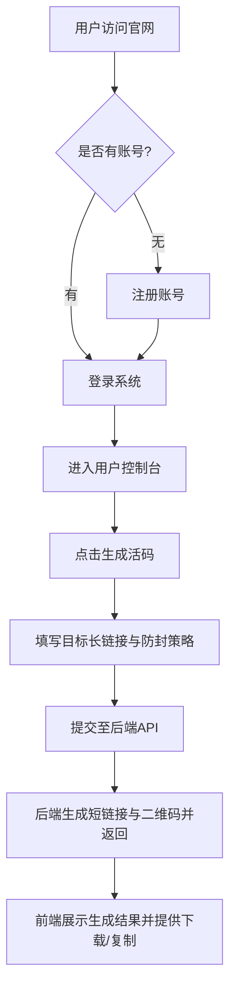

## 1. 产品概述
本项目是一个基于现有 PHP 核心引擎的防封活码系统的现代化前端重构项目。
- 旨在解决原系统前后端高度耦合、UI老旧且交互体验不佳的问题。
- 目标是通过前后端分离，打造一个极具现代感、操作流畅且支持高并发数据渲染的用户与管理员管理后台，同时提供极简且转化率极高的前台官网与落地页。

## 2. 核心功能

### 2.1 用户角色
| 角色 | 注册方式 | 核心权限 |
|------|---------------------|------------------|
| 超级管理员 | 配置文件/后台添加 | 全局数据监控、域名池管理、系统参数设置、用户管理 |
| 普通用户 | 邮箱/账号密码注册 | 生成防封活码、管理短链接、查看个人访问统计数据、账号充值/提现 |

### 2.2 功能模块
1. **前台官网与落地页**: 产品介绍、功能展示、用户注册登录、扫码跳转极速落地页。
2. **用户控制台 (User Dashboard)**: 活码管理列表、链接统计分析、账号设置、充值中心。
3. **管理员控制台 (Admin Dashboard)**: 系统概览、全站数据统计、域名池（落地域名/跳转域名）管理、风控黑名单。

### 2.3 页面详情
| 页面名称 | 模块名称 | 功能描述 |
|-----------|-------------|---------------------|
| 官网首页 | 宣传展示区 | 极简大气的 Hero Section，滚动动画展示防封优势，快捷注册入口 |
| 登录/注册 | 鉴权模块 | 支持验证码校验，密码加密传输，支持 JWT 令牌获取 |
| 用户总览页 | 数据看板 | 个人活码访问量折线图，可用配额环形图，最新动态通告 |
| 活码管理页 | 列表与编辑 | 支持表格展示、批量删除、二维码实时预览下载、短链接一键复制 |
| 系统域名池 | 管理模块 | 管理员专属，添加/检测落地和跳转域名的存活状态 |

## 3. 核心流程
用户登录并生成防封活码的核心流程：

## 4. 用户界面设计
### 4.1 设计风格
- **整体调性**: 现代极简主义 (Modern Minimalist)，融合微毛玻璃效果 (Glassmorphism) 和高级留白。
- **色彩规范**: 
  - 主色调：科技蓝 (Tech Blue, #2563EB) 或 品牌定制色
  - 背景色：浅灰白背景 (Light Gray-White, #F8FAFC) 结合暗色模式 (Dark Mode, #0F172A)
  - 辅助色：成功绿 (#10B981)、警告黄 (#F59E0B)、危险红 (#EF4444)
- **字体与排版**: 
  - 英文字体：Inter 或 Poppins（现代无衬线体）
  - 中文字体：系统默认无衬线（PingFang SC, Microsoft YaHei）
  - 布局：后台采用侧边栏+顶部导航的经典 Dashboard 结构，大圆角卡片式设计 (Border-radius: 12px~16px)。
- **动效 (Motion)**:
  - 页面切换使用平滑淡入淡出 (Fade in/out)
  - 列表项加载使用交错上升动画 (Staggered slide up)
  - 按钮悬停提供轻微的缩放与阴影加深 (Scale 1.02, Box-shadow)

### 4.2 页面设计概览
| 页面名称 | 模块名称 | UI 元素风格 |
|-----------|-------------|-------------|
| 用户控制台 | 侧边栏与导航 | 半透明磨砂质感背景，当前选中项高亮并带有左侧指示条 |
| 数据看板 | 统计卡片 | 纯白卡片，带有微弱的环境阴影，数字采用大号加粗字体，趋势图表色彩渐变填充 |
| 数据表格 | 活码列表 | 斑马纹或 Hover 高亮行，操作列按钮采用图标+文字的幽灵按钮 (Ghost button) 样式 |

### 4.3 响应式设计
- **优先策略**: 采用 Desktop-first（桌面端优先）策略设计复杂的后台管理界面，同时确保 Mobile-adaptive（移动端适配）。
- **移动端优化**: 在手机端隐藏侧边栏改为抽屉式 (Drawer) 菜单，数据表格支持横向滚动或转换为卡片流展示。
