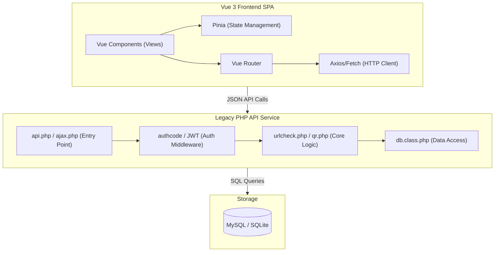
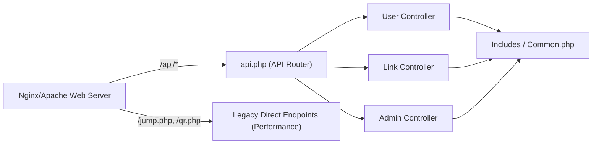
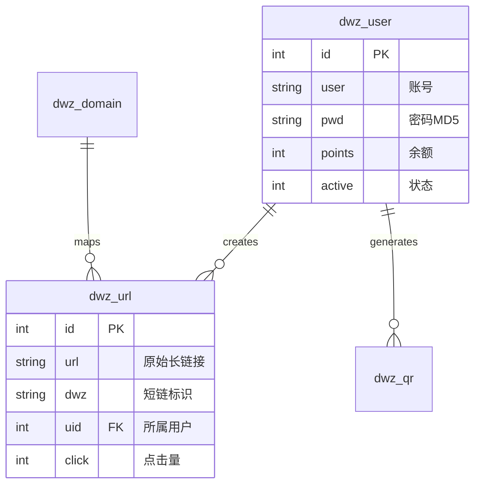

## 1. 架构设计


## 2. 技术说明
- **前端框架**: Vue 3 (Composition API, `<script setup>`)
- **UI 组件库**: Element Plus (高颜值管理后台组件) + Tailwind CSS (辅助快速原子类样式)
- **路由管理**: Vue Router (History Mode)
- **状态管理**: Pinia (用户状态、系统配置缓存)
- **构建工具**: Vite (极速冷启动与热更新)
- **图标库**: `@iconify/vue` 配合 MDI 图标集
- **后端服务**: PHP 7+ 原生混编环境（提取 JSON API）
- **数据存储**: MySQL 或 SQLite (由原有的 `db.class.php` 支持)

## 3. 路由定义
| 路由 | 用途 |
|-------|---------|
| `/` | 官网首页 (宣传页) |
| `/login` | 统一登录/注册页 (用户与管理员入口) |
| `/dashboard` | 普通用户总览看板 |
| `/dashboard/links` | 我的活码管理与生成列表 |
| `/dashboard/billing` | 充值提现中心 |
| `/admin` | 管理员总览看板 |
| `/admin/users` | 系统用户管理与封禁 |
| `/admin/domains` | 域名池检测与管理 |

## 4. API 定义 (后端需提供的接口)
- **统一响应格式**:
  ```typescript
  interface ApiResponse<T> {
    code: number; // 200: 成功, 401: 未授权, 500: 服务器错误
    msg: string;  // 提示信息
    data: T;      // 业务数据
  }
  ```
- **核心接口列表**:
  - `POST /api/v1/auth/login` (返回 JWT/Token)
  - `GET /api/v1/user/info` (获取当前登录用户资料与配额)
  - `GET /api/v1/links/list` (获取用户的活码分页列表)
  - `POST /api/v1/links/create` (生成新活码，传入目标链接与策略)
  - `DELETE /api/v1/links/:id` (删除指定活码)
  - `GET /api/v1/admin/stats` (获取全站访问量、用户数统计)

## 5. 服务器架构图


## 6. 数据模型
（保持现有 PHP 数据库结构不变，前端只负责消费 JSON 数据）
### 6.1 核心表关系简图

